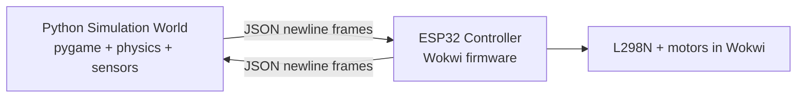

# Hardware-in-the-Loop Robocar Architecture



## Responsibilities
- **ESP32 firmware**: parses sensor JSON, runs navigation/avoidance logic, emits motor commands and control state.
- **Python simulation**: computes kinematics, collision geometry, cone-ray sensors, and renders real-time scene.
- **Serial bridge**: sequence tracking, timeout handling, newline-framed robust JSON protocol.

## Protocol

### Python -> ESP32
```json
{"seq": 123, "dF": 1.25, "dL": 0.85, "dR": 2.10, "dt": 0.05}
```

### ESP32 -> Python
```json
{"seq": 123, "vL": 0.65, "vR": 0.70, "state": "avoid"}
```

- newline (`\n`) delimits each message.
- `seq` is monotonic and used for packet-gap warning.
- timeout behavior:
  - ESP32 safety-stop after 200ms without fresh sensor data.
  - Python keeps last command up to 500ms, then force-stops.

